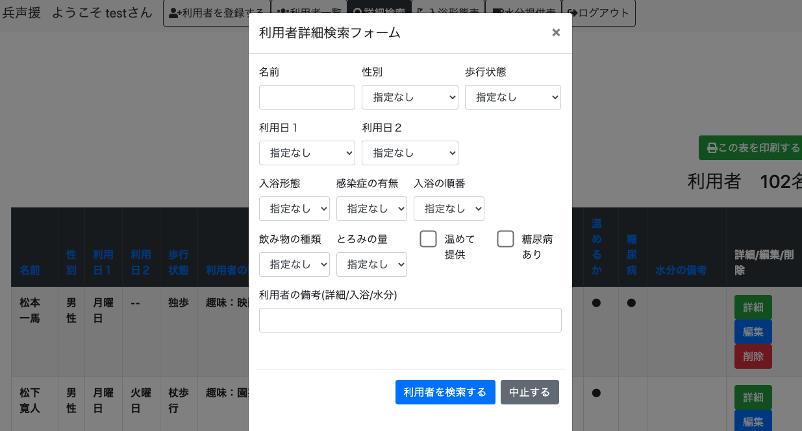
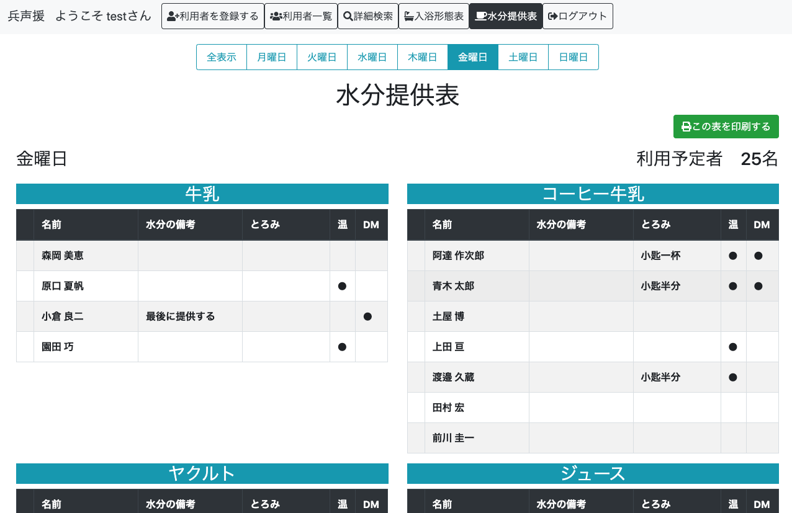
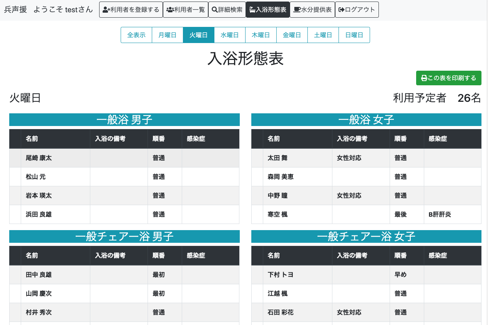
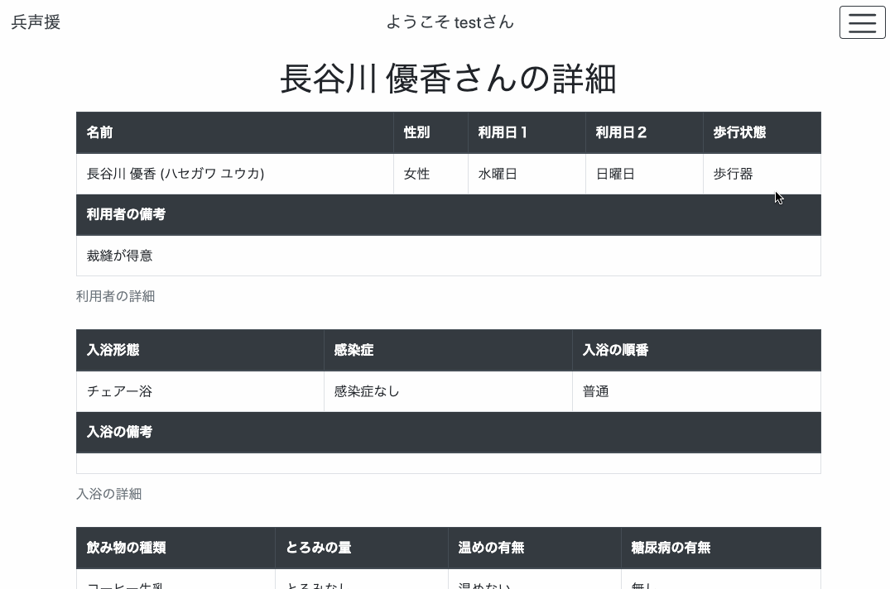

# 兵声援

# 概要
兵声援は利用者の情報を登録しておけば自動的に入浴形態表と水分提供表が出力されるアプリです。 
これを利用することで、利用者の増減や状態の変化に応じて各表を手動で手直しする必要がなくなります。 
このアプリはデジタル化の進んでいない紙媒体がメインのデイサービスの現場での使用を想定しています。 

機能としては 
・利用者情報の登録編集削除機能 
・利用者情報編集時における更新履歴自動記入機能 
・詳細画面より利用者へのコメントできる機能 
・利用者一覧表の表示 
・入浴形態表の表示 
・水分提供表の表示 
・ソート機能 
・詳細検索機能 
・簡易曜日別表示機能 
・印刷機能 
などがあります

# 本番環境
デプロイ先 
Web URL:https://heiseien29232.herokuapp.com/ 

テスト用アカウント  
メールアドレス：test@example.com 
パスワード：password123 

# 利用方法
ユーザー登録を行い、ログインします。 
ログインしたら上部のメニューより利用者情報を登録します。 

利用者情報の登録では基本情報、入浴情報、水分情報の３グループの情報を登録します。 
それぞれ 
苗字、名前、歩行状態、性別、利用日１、利用日２、利用者の備考 
入浴形態、感染症の有無、入浴の順番、入浴の備考 
飲み物の種類、とろみの量、温めて提供するかどうか、糖尿病はあるかどうか 
を入力します。 

利用者情報を登録することで、登録した利用者の情報が利用者一覧表、入浴形態表、水分提供表の画面で登録した情報に応じて該当する表の部分に表示されます。 
それぞれの画面では全表示モードと曜日別表示モードがあるため必要に応じて切り替えることができます。 
また「この表を印刷する」ボタンを押すことで印刷ウィザードを表示し印刷することができます。 

利用者情報の詳細画面を見たいときは利用者一覧画面の詳細ボタンをクリックすることで詳細画面へ遷移することができます。 
詳細画面では登録した利用者の情報が全て見られる他、コメントを残すこともできます。 

利用者情報の編集を行いたいときは、利用者一覧画面あるいは詳細画面で編集ボタンをクリックするか、入浴形態表あるいは水分提供表で利用者の名前をクリックすることで編集画面へと遷移することができます。 
編集画面では利用者情報の変更と更新理由を選択することで編集を行うことができます。 

利用者情報の削除を行いたいときは、利用者一覧画面あるいは詳細画面で削除ボタンを押すことで削除を行うことができます。 

詳細検索ページでは検索したい利用者の情報を入力することで、それに応じた利用者の情報を表示させることができます。 

# 目指した課題解決
このアプリケーションは、介護の、主にデイサービスの現場において表作成の業務を担う人たちの負担を軽減し、介護サービス本来の業務である利用者との触れ合い時間を確保したく思い作成しました。

# 洗い出した要件

| 機能             | 目的                              | 詳細                          | ストーリー（ユースケース）                            |
| :-------------: | :-------------------------------: | :--------------------------: |:--------------------------------------------: |
| ユーザー管理機能   | ユーザー毎に利用者を登録できるようにする   | ログイン機能を追加する             |・名前とメールアドレスを登録することで、ログインできるようにする。 ・別のユーザーが登録した利用者の情報は見えないようになる  |
| 利用者登録機能    |利用者情報を登録できるようにする           |苗字、名前、苗字カナ、名前カナ、性別 利用日１、利用日２、利用者の備考 入浴形態、感染症の有無、入浴の順番 飲み物の種類、とろみの量、温めて提供するかどうか、糖尿病はあるかどうかなどの利用者情報を登録できる|・利用者の基本情報を登録することができるようになる ・選択肢から選ぶことで簡単に入力ができる|
|利用者編集機能|利用者情報を編集できるようにする|利用者情報を編集し、編集した理由を選択肢から選ぶことで編集が行える|・利用者一覧表、詳細画面、入浴形態表、水分提供表の画面から編集画面に遷移することができる 編集内容を自動で検出し、更新履歴として残してくれる|
|利用者削除機能|利用者情報を削除できるようにする|利用者情報を削除した際、基本情報、入浴情報、水分情報などのデータがまとめて削除される|利用者一覧表、あるいは詳細画面から削除ボタンを押すことで、利用者情報の削除が行える。
|利用者詳細機能|利用者の詳細情報を閲覧することができるようにする|利用者の詳細情報画面では登録した情報の全てと更新履歴、コメントを閲覧することができ、編集や削除、コメント投稿ボタンが設置されている|・登録した利用者情報の全てが確認できる。 ・更新履歴が確認できる ・コメントの確認ができる|
|コメント機能|利用者に対するちょっとした記録をつけることができる|利用者に対してコメントを残しておくことができる|・利用者詳細画面でコメントの投稿/編集/削除が行える ・コメントを投稿すると日付と本文が表示される|
|入浴形態表表示機能|登録した利用者情報をもとに、入浴形態表が表示できる|一般浴/一般チェアー浴/チェアー浴の3区分が性別毎に分かれて表示される|・利用者情報が登録されていることが前提 ・一般浴/一般チェアー浴/チェアー浴の３区分でそれぞれ性別毎に分かれた表が表示される。 ・入浴の順番でソートされる ・感染症や入浴の備考なども入力されていれば表示される|
|水分提供表表示機能|登録した利用者情報をもとに、水分提供表が表示できる|牛乳/コーヒー牛乳/ジュース/ヤクルト/ヨーグルト/プリン/牛乳ゼリー/お茶の8区分に分かれて表示される|・利用者情報が登録されていることが前提 ・牛乳/コーヒー牛乳/ジュース/ヤクルト/ヨーグルト/プリン/牛乳ゼリー/お茶の8区分に分かれた表が表示される ・とろみの量や温め、糖尿病の有無、水分の備考なども入力されていれば表示される|
|利用者一覧表表示機能|登録した利用者の情報が一覧で表示できる|名前/性別/利用日/歩行状態/入浴形態/飲み物の種類などの必要な情報が表示される|・利用者情報が登録されていることが前提 ・登録した利用者情報の概要を一覧できる ・利用者情報の詳細画面へと遷移することができる ・利用者情報の編集/削除ボタンが設置されている
|利用者一覧表表示機能|登録した利用者の情報が一覧で表示できる|名前/性別/利用日/歩行状態/入浴形態/飲み物の種類などの必要な情報が表示される|・利用者情報が登録されていることが前提 ・登録した利用者情報の概要を一覧できる ・利用者情報の詳細画面へと遷移することができる ・利用者情報の編集/詳細画面へと遷移することができる|
|利用者曜日別表示機能|利用者情報を利用日（曜日）毎に表示することができる|・ページ上部に設置された曜日ボタン（月下水木金土日）を押すことで、該当する曜日に利用する利用者が表示される。|・利用者情報が登録されていることが前提 ・利用者一覧画面/入浴形態表画面/水分提供表画面において、曜日ボタンを押すことによって該当曜日を利用する利用者だけが表示されるようになる|
|利用者詳細検索機能|ユーザーが簡単に利用者を検索できるようにする|複数条件を指定した上で、見つけたい利用者の検索を可能にする|・利用者情報が登録されていることが前提 ・名前、歩行状態、性別、利用日１、利用日２、利用者の備考、入浴形態、感染症の有無、入浴の順番、入浴の備考、飲み物の種類、とろみの量、温めて提供するかどうか、糖尿病はあるかどうかなどの検索条件を指定する欄を設ける|
|利用者ソート機能|ユーザーが利用者の情報をわかりやすく整理することができるようになる|名前や性別、入浴形態など指定したカラムを基準にしてソートされる|・利用者情報が登録されていることが前提 ・ソートできるのは利用者一覧画面と利用者詳細検索画面|
|印刷ボタン|ユーザーが操作に不慣れでも印刷できるようになる|画面に印刷ボタンを設置し、ブラウザで印刷操作を行わなくてもワンクリックで印刷ウィザードを開ける。|・利用者一覧画面、詳細検索画面、入浴形態表画面、水分提供表画面において、印刷ボタンを押すことですぐ印刷できる。|

# 制作背景
  このアプリは利用者の情報を登録しておけば業務上で必要になる表を自動で出力してくれるアプリです。 
私が以前働いていた介護の現場ではデジタル化が進んでおらず、エクセルを用いて業務に必要な表を作成、後に紙に印刷して使用していたのですが、利用者の増減や状態の変化があるたびにそれらの表を手動で手直しすることが非常に手間となっていました。 
利用者様に対する業務の他、そういった雑務のために事務所に籠っていると肝心の利用者様へのサービスが行えないという悪循環になっていました。 

  そこで私は基本となる利用者情報を登録しておけば、業務上で必要になる表を自動で作成出力してくれるアプリを作りました。 
このアプリを使うことで雑務にかける時間を減らし、本来の目的である利用者へのサービスに時間を当てることができるようになります。 

# 制作意図
  デジタルに不慣れな人が多い環境ではアプリの使用を勧めるのが難しいと言う問題があります。 
自分が働いていた介護現場では、今でも圧倒的に紙が多くデジタル化があまり浸透していなかったり、パソコンでの作業を行える職員も限られていて負担が偏っている現状がありました。 
端末の導入も遅れているため、アプリ単体で完結させるのは難しく、また職員も今までの紙を使ったやり方に慣れてしまっていて新しいやり方に馴染めない職員も多くいらっしゃいました。 

  このアプリは出力した表を「紙に印刷して使ってもらうこと」を前提にしています。 
これはアプリ単体で完結させるのではなく、あくまで「業務に使用する表を手動で編集する手間をなくす」ことを目的にしています。 
正直非合理的な部分もあると思いますが、その代わりに新しいやり方を押し付けるのではなく今までのやり方の手間をなくす方向なので、拒否反応は出ません。 
これは大きいと思いますし、実際に現場の人に使って頂いたところ反応も良かったです。 
全てを変えるのではなく無理なく受け入れられる範囲、あるいは視点から現場を変えられるようにアプリを設計するという視点も重要なのではと思いながら作りました。 

# DEMO
詳細検索ページ

水分提供表ページ

入浴形態表ページ

更新履歴自動記入機能

# 工夫した点
  このアプリはデジタルに不慣れな人でも簡単に扱えるようにとシンプルな作りにしています。 
利用者登録画面や編集画面では極力キーボードを使って入力する箇所を減らし、選択肢を選ぶ形式を多く取り入れたことで誰でも登録や編集ができるようになっています。 
表を見ていてすぐに編集できるよう。トップページ以外でも入浴形態表や水分提供表画面からでも利用者の名前をクリックすることで編集画面にいけるようにしています。 
入浴形態表及び水分提供表のテーブルの一番左の部分には、印刷した後名前をチェックする欄として空白のますを設けています。 
また当初は利用者の情報を更新する時にその理由と内容を手動で入力する形にしていましたが、手間だということでアプリの方で変更箇所を見つけ出し、自動的に記録してくれるようにしました。 
  このアプリはデイサービスでの利用を想定しているため、登録している利用者を曜日別に表示できるようにしました。 
他にも、コメント機能をつけることで日々のちょっとした記録をつけられるようにしたり、印刷ボタンを設置することでワンクリックでの印刷ができるようにしました。 
印刷時のレイアウトも個別に設定することで、ヘッダーメニューや曜日別メニューなど表以外の部分を印刷せずに済むようにしました。 

# 使用技術(開発環境)
HTML 
CSS 
Bootstrap '1.4.2' 
Ruby '2.6.5' 
Ruby on Rails '6.0.0' 
Javascript 
jQuery 
MySQL 0.4.4 

# 課題や今後実装したい機能
詳細検索機能の条件付けがまだ甘いので思い通りの検索ができるようにしたいと思っています。 
また今のところ表示できるのが入浴形態表と水分提供表の２種類だけなので、それ以外の表も作成表示できるようにしたいです。 

# テーブル設計
[ER図](https://app.lucidchart.com/invitations/accept/f4377726-969f-47f2-9c61-0f3528690eac)

## users テーブル

| Column          | Type     | Options                    |
| --------------- | -------- | -------------------------- |
| name            | string   | null: false                |
| email           | string   | null: false, unique: true  |
| password        | string   | null: false                |

### Association

- has_many :guests
- has_many :comments

## guests テーブル

| Column          | Type       | Options                        |
| --------------- | ---------- | ------------------------------ |
| first_name      | string     | null: false                    |
| last_name       | string     | null: false                    |
| first_name_kana | string     | null: false                    |
| last_name_kana  | string     | null: false                    |
| gender_id       | integer    | null: false                    |
| visit1_id       | integer    | null: false                    |
| visit2_id       | integer    | null: false                    |
| adl_id          | integer    | null: false                    |
| description     | text       |                                |
| user            | references | null: false, foreign_key: true |

### Association

- belongs_to :user
- has_one :bath
- has_one :drink
- has_many :comments
- has_many :histories

## baths テーブル

| Column         | Type       | Options                        |
| -------------- | ---------- | ------------------------------ |
| bathing_id     | integer    | null: false                    |
| infection_id   | integer    | null: false                    |
| thickness_id   | integer    | null: false                    |
| guest          | references | null: false, foreign_key: true |
| remark_bath    | string     |                                |

- belongs_to :guest

## drink テーブル

| Column         | Type       | Options                        |
| -------------- | ---------- | ------------------------------ |
| drink_type     | integer    | null: false                    |
| warm           | boolean    | null: false, default: false    |
| thickness_id   | integer    | null: false                    |
| diabetes       | boolean    | null: false, default: false    |
| guest          | references | null: false, foreign_key: true |
| remark_drink   | string     |                                |

- belongs_to :guest

## comments テーブル

| Column          | Type       | Options                        |
| --------------- | ---------- | ------------------------------ |
| text            | text       | null: false                    |
| comment_type_id | integer    | null: false                    |
| user            | references | null: false, foreign_key: true |
| guests          | references | null: false, foreign_key: true |

### Association

- belongs_to :guests
- belongs_to :users

## histories テーブル

| Column          | Type       | Options                        |
| --------------- | ---------- | ------------------------------ |
| log             | text       | null: false                    |
| log_type_id     | integer    | null: false                    |
| guests          | references | null: false, foreign_key: true |

### Association

- belongs_to :guests
