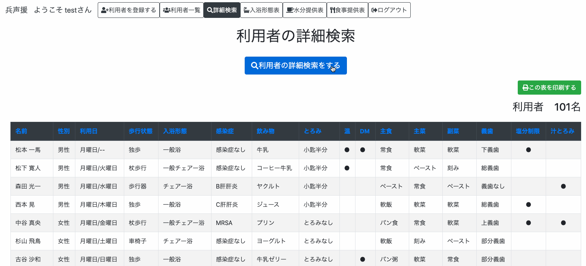
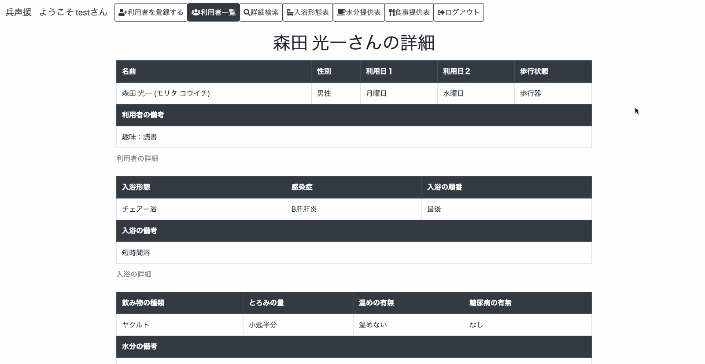
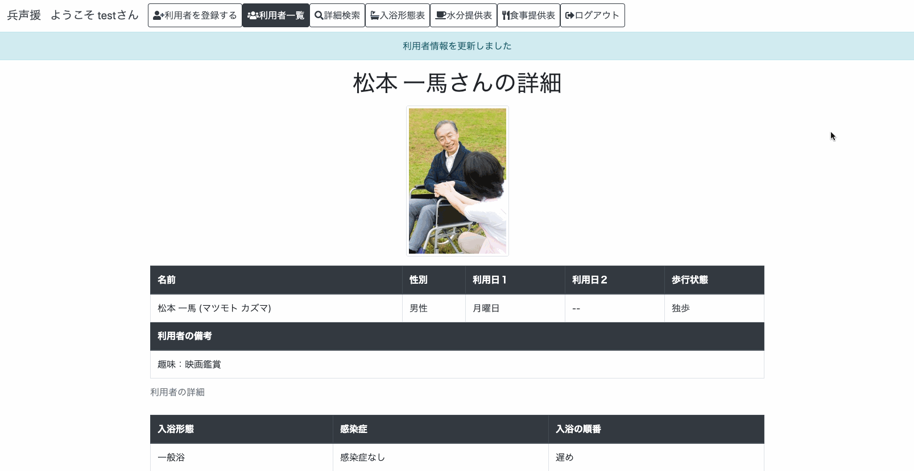

# アプリ名
### 兵声援
前の職場の名前をもじってつけたものです。<br>介護現場で働く人たちにエールを送りたいという意味を込めてつけました。


# 概要
兵声援は利用者の情報を登録しておけば自動的に入浴形態表と水分提供表、食事提供表が出力されるアプリです。<br>
これを利用することで、利用者の増減や状態の変化に応じて変更する必要がある各表を手動で手直しする必要がなくなり、雑務にかける業務時間の短縮に繋がります。<br>
このアプリはデジタル化の進んでいない紙媒体がメインとなるデイサービスの現場での使用を想定しています。<br>

機能としては<br>
・利用者情報の登録編集削除機能<br>
・利用者情報編集時における更新履歴自動記入機能<br>
・詳細画面より利用者へのコメントができる機能<br>
・利用者一覧表の表示<br>
・入浴形態表の表示<br>
・水分提供表の表示<br>
・食事提供表の表示<br>
・ソート機能<br>
・詳細検索機能<br>
・簡易曜日別表示機能<br>
・印刷機能<br>
・顔写真機能<br>f
・プレビュー機能<br>
などがあります

# 本番環境
デプロイ先<br>
Web URL:https://heiseien29232.herokuapp.com/<br>

テスト用アカウント <br>
メールアドレス：test@example.com<br>
パスワード：password123<br>

利用者id1「松本一馬」のみサンプルとして顔写真を登録しております。

# 利用方法
ユーザー登録を行い、ログインします。<br>
ログインしたら上部のメニューより利用者情報を登録します。<br>

利用者情報の登録では基本情報、入浴情報、水分情報、食事情報の4グループの情報を登録します。<br>
それぞれ<br>
顔写真、苗字、名前、歩行状態、性別、利用日１、利用日２、利用者の備考<br>
入浴形態、感染症の有無、入浴の順番、入浴の備考<br>
飲み物の種類、とろみの量、温めて提供するかどうか、糖尿病はあるかどうか、水分の備考<br>
主食の形態、主食の量、主菜の形態、主菜の量、副菜の形態、副菜の量、禁止食材、塩分制限、汁物にとろみをつけるかどうか、義歯の種類、食事の備考<br>
を入力します。<br>

利用者情報を登録することで、登録した利用者の情報が利用者一覧表、入浴形態表、水分提供表、食事提供表の画面で登録した情報に応じて該当する表の部分に表示されます。<br>
それぞれの画面では全表示モードと曜日別表示モードがあるため必要に応じて切り替えることができます。<br>
また「この表を印刷する」ボタンを押すことで印刷ウィザードを表示し印刷することができます。<br>

利用者情報の詳細画面を見たいときは利用者一覧画面の詳細ボタンをクリックすることで詳細画面へ遷移することができます。<br>
詳細画面では登録した利用者の情報が全て見られる他、コメントを残すこともできます。<br>

利用者情報の編集を行いたいときは、利用者一覧画面あるいは詳細画面で編集ボタンをクリックするか、入浴形態表、水分提供表、食事提供表のいずれかで利用者の名前をクリックすることで編集画面へと遷移することができます。<br>
編集画面では利用者情報の変更と更新理由を選択することで編集を行うことができます。<br>

利用者情報の削除を行いたいときは、利用者一覧画面あるいは詳細画面で削除ボタンを押すことで削除を行うことができます。<br>

詳細検索ページでは検索したい利用者の情報を入力することで、それに応じた利用者の情報を表示させることができます。<br>
詳細検索ページで利用者の名前をクリックすると詳細画面へと遷移することができます。

# 目指した課題解決
このアプリケーションは、介護の、主にデイサービスの現場において、表作成の業務を担う人たちの負担を軽減し、介護サービス本来の業務である利用者との触れ合い時間を確保したいと思い作成しました。

# 洗い出した要件

| 機能             | 目的                              | 詳細                          | ストーリー（ユースケース）                            |
| :-------------: | :-------------------------------: | :--------------------------: |:--------------------------------------------: |
| ユーザー管理機能   | ユーザー毎に利用者を登録できるようにする   | ログイン機能を追加する             |・名前とメールアドレスを登録することで、ログインできるようにする。<br>・別のユーザーが登録した利用者の情報は見えないようになる  |
| 利用者登録機能    |利用者情報を登録できるようにする           |苗字、名前、苗字カナ、名前カナ、性別<br>利用日１、利用日２、利用者の備考<br>入浴形態、感染症の有無、入浴の順番<br>飲み物の種類、とろみの量、温めて提供するかどうか、糖尿病はあるかどうかなどの利用者情報を登録できる|・利用者の基本情報を登録することができるようになる<br>・選択肢から選ぶことで簡単に入力ができる|
|利用者編集機能|利用者情報を編集できるようにする|利用者情報を編集し、編集した理由を選択肢から選ぶことで編集が行える|・利用者一覧表、詳細画面、入浴形態表、水分提供表の画面から編集画面に遷移することができる<br>編集内容を自動で検出し、更新履歴として残してくれる|
|利用者削除機能|利用者情報を削除できるようにする|利用者情報を削除した際、基本情報、入浴情報、水分情報などのデータがまとめて削除される|・利用者一覧表、あるいは詳細画面から削除ボタンを押すことで、利用者情報の削除が行える。
|利用者詳細機能|利用者の詳細情報を閲覧することができるようにする|利用者の詳細情報画面では登録した情報の全てと更新履歴、コメントを閲覧することができ、編集や削除、コメント投稿ボタンが設置されている|・登録した利用者情報の全てが確認できる。<br>・更新履歴が確認できる<br>・コメントの確認ができる|
|コメント機能|利用者に対するちょっとした記録をつけることができる|利用者に対してコメントを残しておくことができる|・利用者詳細画面でコメントの投稿/編集/削除が行える<br>・コメントを投稿すると日付と本文が表示される|
|入浴形態表表示機能|登録した利用者情報をもとに、入浴形態表が表示できる|一般浴/一般チェアー浴/チェアー浴の3区分が性別毎に分かれて表示される|・利用者情報が登録されていることが前提<br>・一般浴/一般チェアー浴/チェアー浴の３区分でそれぞれ性別毎に分かれた表が表示される。<br>・入浴の順番でソートされる<br>・感染症や入浴の備考なども入力されていれば表示される|
|水分提供表表示機能|登録した利用者情報をもとに、水分提供表が表示できる|牛乳/コーヒー牛乳/ジュース/ヤクルト/ヨーグルト/プリン/牛乳ゼリー/お茶の8区分に分かれて表示される|・利用者情報が登録されていることが前提<br>・牛乳/コーヒー牛乳/ジュース/ヤクルト/ヨーグルト/プリン/牛乳ゼリー/お茶の8区分に分かれた表が表示される<br>・とろみの量や温め、糖尿病の有無、水分の備考なども入力されていれば表示される|
|食事提供表表示機能|登録した利用者情報をもとに、食事提供表が表示できる|登録している利用者の食事提供情報（主食の形態、主食の量、主菜の形態、主菜の量、副菜の形態、副菜の量、禁止食材、塩分制限、汁物にとろみをつけるかどうか、義歯の種類、食事の備考）が表形式で一覧となって表示される|・利用者情報が登録されていることが前提<br>・利用者の食事情報をまとめた表が表示される<br>・禁止食材や食事の備考なども入力されていれば表示される|
|タグ機能（禁止食材）|禁止食材をタグで細かく管理できる|禁止食材を登録する際、それらはタグとして管理される|・禁止食材を複数種類、登録することができる|
|利用者一覧表表示機能|登録した利用者の情報が一覧で表示できる|名前/性別/利用日/歩行状態/入浴形態/飲み物の種類などの必要な情報が表示される|・利用者情報が登録されていることが前提<br>・登録した利用者情報の概要を一覧できる<br>・利用者情報の詳細画面へと遷移することができる<br>・利用者情報の編集/削除ボタンが設置されている|
|利用者曜日別表示機能|利用者情報を利用日（曜日）毎に表示することができる|・ページ上部に設置された曜日ボタン（月下水木金土日）を押すことで、該当する曜日に利用する利用者が表示される。|・利用者情報が登録されていることが前提<br>・利用者一覧画面/入浴形態表画面/水分提供表画面/食事提供表画面において、曜日ボタンを押すことによって該当曜日を利用する利用者だけが表示されるようになる|
|利用者詳細検索機能|ユーザーが簡単に利用者を検索できるようにする|複数条件を指定した上で、見つけたい利用者の検索を可能にする|・利用者情報が登録されていることが前提<br>・基本情報、入浴情報、水分情報、食事状況などの検索条件を指定することで利用者の検索を行うことができる<br>・利用者一覧画面/詳細検索画面で検索結果を表示することができる|
|利用者ソート機能|ユーザーが利用者の情報をわかりやすく整理することができるようになる|名前や性別、入浴形態など指定したカラムを基準にしてソートされる|・利用者情報が登録されていることが前提<br>・ソートできるのは利用者一覧画面と利用者詳細検索画面|
|印刷ボタン|ユーザーが操作に不慣れでも印刷できるようになる|画面に印刷ボタンを設置し、ブラウザで印刷操作を行わなくてもワンクリックで印刷ウィザードを開ける。|・利用者一覧画面、詳細検索画面、入浴形態表画面、水分提供表画面において、印刷ボタンを押すことですぐ印刷できる。|
|顔写真機能|利用者の顔と名前を一致しやすくなる|画像の登録/表示/上書きができる|・利用者の写真を登録/上書きすることができる<br>・登録した写真は詳細画面で閲覧することができる<br>・写真を登録していない場合汎用画像が表示される|
|プレビュー機能|選択した写真が意図した通りのものか確認しやすくなる|画像を登録する際、画像のプレビューが表示される|・登録画面あるいは編集画面で画像を選択した時、画像のプレビューが表示される<br>・すでに登録した画像があった場合それを表示する。また、プレビューは常に最後に選択した画像のみが表示される。|


# 制作背景
  このアプリは利用者の情報を登録しておけば業務上で必要になる表を自動で出力してくれるアプリです。<br>
私が以前働いていた介護の現場ではデジタル化が進んでおらず、エクセルを用いて業務に必要な表を作成、後に紙に印刷して使用していたのですが、利用者の増減や状態の変化があるたびにそれらの表を手動で手直しすることが非常に手間となっていました。<br>
結果としてそういった雑務のために事務所に籠っていると肝心の利用者へのサービスが行えないという悪循環になっていました。<br>

  そこで私は表作成に使う時間を短縮したいと考え、このアプリを作りました。<br>
このアプリを使うことで雑務にかける時間を減らし、本来の目的である利用者へのサービスに時間を当てることができるようになります。<br>

# 制作意図
  デジタルに不慣れな人が多い環境ではアプリの使用を勧めるのが難しいと言う問題があります。<br>
自分が働いていた介護現場では、今でも圧倒的に紙が多くデジタル化があまり浸透していなかったり、パソコンでの作業を行える職員も限られていて負担が偏っている現状がありました。<br>
端末の導入も遅れているため、アプリ単体で完結させるのは難しく、また職員も今までの紙を使ったやり方に慣れてしまっていて新しいやり方に馴染めない職員も多くいらっしゃいました。<br>

  このアプリは出力した表を「紙に印刷して使ってもらうこと」を前提にしています。<br>
これはアプリ単体で完結させるのではなく、あくまで「業務に使用する表を手動で編集する手間をなくす」ことを目的にしています。<br>
正直非合理的な部分もあると思いますが、その代わりに新しいやり方を押し付けるのではなく今までのやり方の手間をなくす方向なので、拒否反応は出ません。<br>
これは大きいと思いますし、実際に現場の人に使って頂いたところ反応も良かったです。<br>
全てを変えるのではなく無理なく受け入れられる範囲、あるいは視点から現場を変えられるようにアプリを設計するという視点も重要なのではと思いながら作りました。<br>

# DEMO
## 利用者一覧表（トップページ）


ユーザーが登録した利用者が一覧となって表示されます。<br>
ここでは利用者の状態把握に最低限必要となる登録した情報の一部（名前、性別、利用日、歩行状態、入浴形態、飲み物の状態、主食の形態など）が表示されます。<br>
利用者の名前の右端にあるボタンを押すことで各利用者の詳細画面へと遷移したり、編集や削除をすることができます。<br>
また、上部にある曜日ボタンを押すことで利用する曜日別に利用者を表示することができます。<br>
検索機能やソート機能も使うことができます。<br>

## 利用者登録ページ

ここでは利用者の情報を登録することができます。<br>
入力する情報の多くは選択肢から選ぶことができ、登録の手間が少なくなっています。<br>
（デモでは動画時間を短縮するために名前などは事前に入力してあります）<br>
必要に応じて利用者の写真を登録したり、詳細や備考を入力することでより詳しい情報を登録することもできます。<br>

## 利用者詳細ページ

ここでは登録した利用者の情報を全て確認することができます。<br>
このページからでも編集や削除を行うことができます。<br>
後述しますが、更新履歴が自動で記録されたりコメントを残すことができる機能もあります。<br>


## 詳細検索ページ


詳細検索ページです。<br>
ここでは登録した利用者の情報が利用者一覧よりも多く表示されます。<br>
詳細検索フォームで条件を指定して検索することで、条件にあった利用者を表示することができます。<br>

## 入浴形態表ページ


ここでは登録した情報に応じて、入浴形態表の該当テーブルに利用者の名前が表示されます。<br>
入浴の備考、入浴の順番、感染症の有無などの情報も表示されます。<br>
利用者の名前は入浴する順番でソートされるようになっています。<br>
上部の曜日ボタンを押すことによって、利用する曜日別に利用者の表示を切り替えることができます。<br>
曜日別表示に切り替えた場合、各曜日における利用者の人数も表示されます。<br>
また、利用者の名前をクリックすることにより、直接利用者の編集画面へと遷移することができます。<br>
入浴形態表ページから編集した後は再び入浴形態表ページに遷移するようになっています。<br>
印刷ボタンが設置されており、ボタンをクリックすることで印刷ウィザードを開くことができるようになっています。<br>
入浴形態表のレイアウトはそのまま印刷して使えるようになっています。<br>

## 水分提供表ページ


ここでは登録した情報に応じて、水分提供表の該当テーブルに利用者の名前が表示されます。<br>
水分の備考、とろみの量、温めるか否か、糖尿病（DM）の有無などの情報も表示されます。<br>
上部の曜日ボタンを押すことによって、利用する曜日別に利用者の表示を切り替えることができます。<br>
曜日別表示に切り替えた場合、各曜日における利用者の人数も表示されます。<br>
また、利用者の名前をクリックすることにより、直接利用者の編集画面へと遷移することができます。<br>
水分提供表ページから編集した後は再び水分提供表ページに遷移するようになっています。<br>
印刷ボタンが設置されており、ボタンをクリックすることで印刷ウィザードを開くことができるようになっています。<br>
水分提供表のレイアウトはそのまま印刷して使えるようになっています。<br>

## 食事提供表ページ


ここでは登録した利用者の食事に関する情報が一覧となって表示されます。<br>
禁止食材、塩分制限、汁物のとろみ、食事の備考などの情報も表示されます。<br>
上部の曜日ボタンを押すことによって、利用する曜日別に利用者の表示を切り替えることができます。<br>
曜日別表示に切り替えた場合、各曜日における利用者の人数も表示されます。<br>
また、利用者の名前をクリックすることにより、直接利用者の編集画面へと遷移することができます。<br>
食事提供表ページから編集した後は再び食事提供表ページに遷移するようになっています。<br>
印刷ボタンが設置されており、ボタンをクリックすることで印刷ウィザードを開くことができるようになっています。<br>

## 顔写真機能 プレビュー機能


利用者の顔写真を登録することができます。<br>
デイサービスは利用者の数が膨大な上、日替わりで利用されるので顔と名前を一致させるのに時間がかかってしまいます。<br>
顔と名前を一致させるためにも、写真を登録できる機能は必要だと考え実装しました。<br>
全員が写真を登録できるわけでもないので、写真を登録していない場合は非表示となります。<br>

## 更新履歴自動記入機能


編集画面で編集した理由と内容が自動で記録されます。<br>
本人に関する情報や、提供するサービスを変更した場合、後で振り返るためにも変更した理由と内容を必ず記入する必要があるのですが<br>
編集のたびに手動で入力するのは手間だと考え、自動で記録できるように工夫しました。<br>

## コメント機能


利用者詳細画面より日々のちょっとした記録などをコメントとして残すことができます。<br>


# 工夫した点
工夫した点は大きく二つ挙げられます。<br>
一つ目は介護現場で実際に使う人の意見を大切にしたこと。<br>
二つ目はなるべくシンプルで不慣れな人にも使いやすい作りにしたことです。<br>

　このアプリは私の前の職場である介護現場にお邪魔して職員の方に実際に使ってもらい、入力画面の遷移先やあると嬉しい機能など、実際に意見や感想を頂いた上でそれを活かして開発を行いました。<br>
 また、デジタルに不慣れな人でも簡単に扱えるようにと極力シンプルな作りにしています。<br>

具体的な箇所を上げていきます。<br>
利用者登録画面や編集画面では極力キーボードを使って入力する箇所を減らし、選択肢を選ぶ形式を多く取り入れたことで誰でも登録や編集ができるようになっています。<br>
細かいところでは表を見ていて直したい箇所はすぐに編集できるよう、トップページ以外でも入浴形態表や水分提供表画面、食事提供表画面からでも利用者の名前をクリックすることで編集画面にいけるようにしています。<br>
またその結果をすぐに確認できるように、編集後は元のページの各表（入浴形態表・水分提供表・食事提供表）に戻れるよう工夫しました。<br>
当初は利用者の情報を更新する時にその理由と内容を手動で入力する形にしていましたが、手間だということでアプリの方で変更箇所を見つけ出し、自動的に記録してくれるようにしました。<br>
入浴形態表及び水分提供表のテーブルの一番左の部分には、印刷した後名前をチェックする欄として空白のマスを設けています。<br>
デイサービスでの利用を想定しているため、各表では登録している利用者を曜日別に表示できるようにしています。<br>
また、顔写真を登録できるようにしたことで利用者の顔と名前が一致しやすくしたり、コメント機能をつけることで日々のちょっとした記録もつけられるようにしています。<br>
他にも、操作に不慣れな人用に印刷ボタンを設置することでワンクリックでの印刷ができるようにしました。<br>
印刷時のレイアウトも個別に設定することで、ヘッダーメニューや曜日別メニューなど表以外の部分を印刷せずに済むようになっています。<br>


# 使用技術(開発環境)
## バックエンド
Ruby '2.6.5'<br>
Ruby on Rails '6.0.0'

## フロントエンド
HTML<br>
SASS<br>
Bootstrap '1.4.2'<br>
Javascript<br>
jquery 3.5.1<br>
popper.js 1.16.1<br>

## データベース
MySQL 0.4.4

## Webサーバ(本番環境)
heroku

## アプリケーションサーバ（本番環境）
heroku

## ソース管理
GitHub,GitHubDesktop

## テスト
RSpec

## エディタ
VScode

# 課題や今後実装したい機能
詳細検索機能の条件付けがまだ甘いので思い通りの検索ができるようにしたいと思っています。<br>
禁止食材を登録する際、DBに登録されている候補が表示されるようにしたいです。<br>


# テーブル設計
[ER図](https://app.lucidchart.com/invitations/accept/f4377726-969f-47f2-9c61-0f3528690eac)

## users テーブル

| Column          | Type     | Options                    |
| --------------- | -------- | -------------------------- |
| name            | string   | null: false                |
| email           | string   | null: false, unique: true  |
| password        | string   | null: false                |


### Association

- has_many :guests
- has_many :comments

## guests テーブル

| Column          | Type       | Options                        |
| --------------- | ---------- | ------------------------------ |
| first_name      | string     | null: false                    |
| last_name       | string     | null: false                    |
| first_name_kana | string     | null: false                    |
| last_name_kana  | string     | null: false                    |
| gender_id       | integer    | null: false                    |
| visit1_id       | integer    | null: false                    |
| visit2_id       | integer    | null: false                    |
| adl_id          | integer    | null: false                    |
| description     | text       |                                |
| user            | references | null: false, foreign_key: true |

### Association

- belongs_to :user
- has_one :bath
- has_one :drink
- has_one :food
- has_many :comments
- has_many :histories

## baths テーブル

| Column         | Type       | Options                        |
| -------------- | ---------- | ------------------------------ |
| bathing_id     | integer    | null: false                    |
| infection_id   | integer    | null: false                    |
| thickness_id   | integer    | null: false                    |
| guest          | references | null: false, foreign_key: true |
| remark_bath    | string     |                                |

- belongs_to :guest

## drinks テーブル

| Column         | Type       | Options                        |
| -------------- | ---------- | ------------------------------ |
| drink_type_id  | integer    | null: false                    |
| warm           | boolean    | null: false, default: false    |
| thickness_id   | integer    | null: false                    |
| diabetes       | boolean    | null: false, default: false    |
| guest          | references | null: false, foreign_key: true |
| remark_drink   | string     |                                |

- belongs_to :guest

## foods テーブル

| Column               | Type       | Options                        |
| -------------------- | ---------- | ------------------------------ |
| staple_type_id       | integer    | null: false                    |
| staple_amount_id     | integer    | null: false                    |
| main_dish_type_id    | integer    | null: false                    |
| main_dish_amount_id  | integer    | null: false                    |
| side_dish_type_id    | integer    | null: false                    |
| side_dish_amount_id  | integer    | null: false                    |
| low_salt             | boolean    | null: false, default: false    |
| soup_thick           | boolean    | null: false, default: false    |
| denture_id           | integer    | null: false                    |
| remark_food          | string     |                                |
| guest                | references | null: false, foreign_key: true |

- belongs_to :guest
- has_many :forbids, through: :food_forbid_relations

## food_forbid_relations テーブル

| Column               | Type       | Options                        |
| -------------------- | ---------- | ------------------------------ |
| food                 | references | null: false, foreign_key: true |
| forbid               | references | null: false, foreign_key: true |

- belongs_to :food
- belongs_to :forbid

## forbids テーブル

| Column      | Type    | Options                        |
| ----------- | ------- | ------------------------------ |
| forbid_food | string  | null:false, uniqueness: true   |

- has_many :foods, through: :food_forbid_relations

## comments テーブル

| Column          | Type       | Options                        |
| --------------- | ---------- | ------------------------------ |
| text            | text       | null: false                    |
| comment_type_id | integer    | null: false                    |
| user            | references | null: false, foreign_key: true |
| guests          | references | null: false, foreign_key: true |

### Association

- belongs_to :guests
- belongs_to :users

## histories テーブル

| Column          | Type       | Options                        |
| --------------- | ---------- | ------------------------------ |
| log             | text       | null: false                    |
| log_type_id     | integer    | null: false                    |
| guests          | references | null: false, foreign_key: true |

### Association

- belongs_to :guests


# ローカルでの動作方法
```
% git clone https://git.heroku.com/heiseien29232.git
% cd heiseien29232
% bundle install
% rails db:create
% rails db:migrate
% rails db:seed #(必要であればテスト用データの読み込み)
% yarn add bootstrap@4.5.2 jquery popper.js
% yarn add @fortawesome/fontawesome-free
% rails s
👉 http://localhost:3000
```
テスト用アカウント <br>
メールアドレス：test@example.com<br>
パスワード：password123<br>

# 使用した素材
[Icon rainbow](https://icon-rainbow.com/)<br>
[muon-ashさんによる写真ACからの写真](https://www.photo-ac.com/profile/2020346)<br>
[acworksさんによる写真ACからの写真](https://www.photo-ac.com/profile/43626)<br>
[kscz58ynkさんによる写真ACからの写真](https://www.photo-ac.com/profile/824623)<br>

