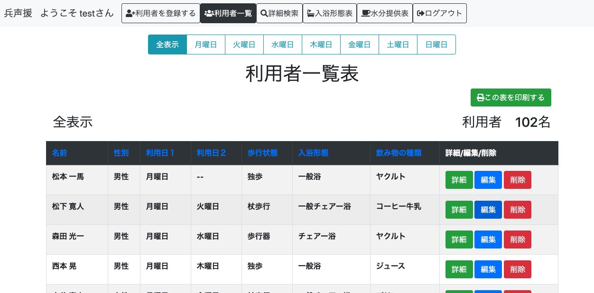

# 兵声援

# 概要
兵声援は利用者の情報を登録しておけば自動的に入浴形態表と水分提供表が出力されるアプリです。 
これを利用することで、利用者の増減や状態の変化に応じて各表を手動で手直しする必要がなくなります。 
このアプリはデジタル化の進んでいない紙媒体がメインのデイサービスの現場での使用を想定しています。 

機能としては 
・利用者情報の登録編集削除機能 
・利用者情報編集時における更新履歴自動記入機能 
・詳細画面より利用者へのコメントできる機能 
・利用者一覧表の表示 
・入浴形態表の表示 
・水分提供表の表示 
・ソート機能 
・詳細検索機能 
・簡易曜日別表示機能 
・印刷機能 
などがあります

# 本番環境
デプロイ先 
Web URL:https://heiseien29232.herokuapp.com/ 

テスト用アカウント  
メールアドレス：test@example.com 
パスワード：password123 

# 制作背景
  このアプリは利用者の情報を登録しておけば業務上で必要になる表を自動で出力してくれるアプリです。 
私が以前働いていた介護の現場ではデジタル化が進んでおらず、エクセルを用いて業務に必要な表を作成、後に紙に印刷して使用していたのですが、利用者の増減や状態の変化があるたびにそれらの表を手動で手直しすることが非常に手間となっていました。 
利用者様に対する業務の他、そういった雑務のために事務所に籠っていると肝心の利用者様へのサービスが行えないという悪循環になっていました。 

  そこで私は基本となる利用者情報を登録しておけば、業務上で必要になる表を自動で作成出力してくれるアプリを作りました。 
このアプリを使うことで雑務にかける時間を減らし、本来の目的である利用者へのサービスに時間を当てることができるようになります。 

# 制作意図
  デジタルに不慣れな人が多い環境ではアプリの使用を勧めるのが難しいと言う問題があります。 
自分が働いていた介護現場では、今でも圧倒的に紙が多くデジタル化があまり浸透していなかったり、パソコンでの作業を行える職員も限られていて負担が偏っている現状がありました。 
端末の導入も遅れているため、アプリ単体で完結させるのは難しく、また職員も今までの紙を使ったやり方に慣れてしまっていて新しいやり方に馴染めない職員も多くいらっしゃいました。 

  このアプリは出力した表を「紙に印刷して使ってもらうこと」を前提にしています。 
これはアプリ単体で完結させるのではなく、あくまで「業務に使用する表を手動で編集する手間をなくす」ことを目的にしています。 
正直非合理的な部分もあると思いますが、その代わりに新しいやり方を押し付けるのではなく今までのやり方の手間をなくす方向なので、拒否反応は出ません。 
これは大きいと思いますし、実際に現場の人に使って頂いたところ反応も良かったです。 
全てを変えるのではなく無理なく受け入れられる範囲、あるいは視点から現場を変えられるようにアプリを設計するという視点も重要なのではと思いながら作りました。 

# DEMO

# 工夫した点
  このアプリはデジタルに不慣れな人でも簡単に扱えるようにとシンプルな作りにしています。 
利用者登録画面や編集画面では極力キーボードを使って入力する箇所を減らし、選択肢を選ぶ形式を多く取り入れたことで誰でも登録や編集ができるようになっています。 
表を見ていてすぐに編集できるよう。トップページ以外でも入浴形態表や水分提供表画面からでも利用者の名前をクリックすることで編集画面にいけるようにしています。 
また当初は利用者の情報を更新する時にその理由と内容を手動で入力する形にしていましたが、手間だということでアプリの方で変更箇所を見つけ出し、自動的に記録してくれるようにしました。 
  このアプリはデイサービスでの利用を想定しているため、登録している利用者を曜日別に表示できるようにしました。 
他にも、コメント機能をつけることで日々のちょっとした記録をつけられるようにしたり、印刷ボタンを設置することでワンクリックでの印刷ができるようにしました。 

# 使用技術(開発環境)
HTML 
CSS 
Bootstrap '1.4.2' 
Ruby '2.6.5' 
Ruby on Rails '6.0.0' 
Javascript 
jQuery 
MySQL 0.4.4 

# 課題や今後実装したい機能
詳細検索機能の条件付けがまだ甘いので思い通りの検索ができるようにしたいと思っています。 
また今のところ表示できるのが入浴形態表と水分提供表の２種類だけなので、それ以外の表も作成表示できるようにしたいです。 

# テーブル設計

## users テーブル

| Column          | Type     | Options                    |
| --------------- | -------- | -------------------------- |
| name            | string   | null: false                |
| email           | string   | null: false, unique: true  |
| password        | string   | null: false                |

### Association

- has_many :guests
- has_many :comments

## guests テーブル

| Column          | Type       | Options                        |
| --------------- | ---------- | ------------------------------ |
| first_name      | string     | null: false                    |
| last_name       | string     | null: false                    |
| first_name_kana | string     | null: false                    |
| last_name_kana  | string     | null: false                    |
| gender_id       | integer    | null: false                    |
| visit1_id       | integer    | null: false                    |
| visit2_id       | integer    | null: false                    |
| adl_id          | integer    | null: false                    |
| description     | text       |                                |
| user            | references | null: false, foreign_key: true |

### Association

- belongs_to :user
- has_one :bath
- has_one :drink
- has_many :comments
- has_many :histories

## baths テーブル

| Column         | Type       | Options                        |
| -------------- | ---------- | ------------------------------ |
| bathing_id     | integer    | null: false                    |
| infection_id   | integer    | null: false                    |
| thickness_id   | integer    | null: false                    |
| guest          | references | null: false, foreign_key: true |
| remark_bath    | string     |                                |

- belongs_to :guest

## drink テーブル

| Column         | Type       | Options                        |
| -------------- | ---------- | ------------------------------ |
| drink_type     | integer    | null: false                    |
| warm           | boolean    | null: false, default: false    |
| thickness_id   | integer    | null: false                    |
| diabetes       | boolean    | null: false, default: false    |
| guest          | references | null: false, foreign_key: true |
| remark_drink   | string     |                                |

- belongs_to :guest

## comments テーブル

| Column          | Type       | Options                        |
| --------------- | ---------- | ------------------------------ |
| text            | text       | null: false                    |
| comment_type_id | integer    | null: false                    |
| user            | references | null: false, foreign_key: true |
| guests          | references | null: false, foreign_key: true |

### Association

- belongs_to :guests
- belongs_to :users

## histories テーブル

| Column          | Type       | Options                        |
| --------------- | ---------- | ------------------------------ |
| log             | text       | null: false                    |
| log_type_id     | integer    | null: false                    |
| guests          | references | null: false, foreign_key: true |

### Association

- belongs_to :guests
